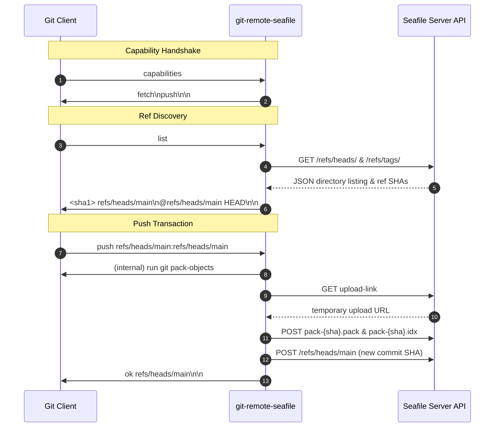

# Architecture & Design Specification: git-remote-seafile

**Author**: Community Contribution  
**Target Organization**: [haiwen](https://github.com/haiwen) (Seafile Ecosystem)  
**Status**: Ready for Upstream Integration  

---

## 1. Executive Summary

`git-remote-seafile` introduces native Git remote support for Seafile servers using Git's standard Remote Helper specification (`gitremote-helpers(7)`).

It allows Seafile users and organizations to use existing Seafile libraries for private, encrypted, access-controlled Git repository hosting without:
1. Deploying a separate Git server (e.g. GitLab, Gitea), or
2. Experiencing the severe performance thrashing and data corruption that occurs when placing live `.git/` working trees inside desktop-synced folders.

---

## 2. Background & Problem Statement

Seafile's desktop synchronization client (`seaf-daemon`) is designed for document and file synchronization. When developers store active code repositories within synced libraries (e.g. `Documents/code/`), pathological failure modes emerge:

1. **Continuous Thrashing**: Git operations frequently write to `.git/` (`index.lock`, `objects/tmp_obj_*`, `COMMIT_EDITMSG`, `refs/heads/*`). Each write triggers full-library re-index cycles (hundreds of cycles daily).
2. **Lock Synchronization**: Ephemeral `.git/*.lock` files are synced across devices, locking Git on secondary machines.
3. **Conflict Storms**: When two machines edit code concurrently, the sync daemon generates `* (SFConflict ...).*` duplicate files rather than performing a 3-way line merge.

Attempting to fix this by modifying the desktop client to understand Git is technically fragile due to platform differences, stat cache discrepancies in `.git/index`, and concurrent worktree races.

### 2.1 Why Client-Side Daemon Patches Fail (Case Study: `vacaboja/seafile`)

Recent community efforts (such as the `vacaboja/seafile` fork and [PR #2988](https://github.com/haiwen/seafile/pull/2988) to `haiwen/seafile`) attempted to solve Git object loss by modifying the Linux sync daemon (`daemon/wt-monitor-linux.c`):
- **The specific bug addressed**: Upstream Seafile intentionally ignores `IN_CREATE` for regular files, assuming GUI copy tools will later fire `IN_CLOSE_WRITE`. When Git creates objects or packfiles via the `link(2)` syscall (hard links) or atomic link-renames, `IN_CREATE` fires on the directory, but **no file descriptor is opened or closed**. Upstream Seafile drops `IN_CREATE`, misses the file entirely, and silently omits the Git object from server uploads ([haiwen/seafile#2677](https://github.com/haiwen/seafile/issues/2677), [#2833](https://github.com/haiwen/seafile/issues/2833)).
- **The fork's workaround**: Queues `IN_CREATE` events in a 1-second timeout hash table (`recheck_accu`) and checks if nanosecond `st_mtim` remains unchanged, synthesising a deferred `WT_EVENT_CREATE_OR_UPDATE`.
- **Why client-side patches remain fundamentally insufficient**:
  1. **Platform-isolated**: The patch is strictly Linux-only (`wt-monitor-linux.c`), ignoring Windows and macOS.
  2. **Multi-file race conditions**: Commits write loose objects, `.git/index`, and `refs/heads/*` non-atomically. Asynchronous HTTP block syncing means peers can receive an updated branch ref before the underlying object blocks finish uploading, crashing commands with `fatal: bad object HEAD`.
  3. **Lock file propagation**: `.git/*.lock` files still sync across devices, freezing active repositories on secondary machines.
  4. **Merge conflicts**: Offline or simultaneous commits continue generating unresolvable `(SFConflict ...)` files rather than 3-way Git merges.

### 2.2 The Windows Dilemma: Same-Second Edits & Mandatory File Locks

On Windows systems, desktop syncing of active code introduces additional OS-level failure modes:
1. **1-Second `mtime` Truncation ("Racy Sync")**:
   Seafile's index format (`common/index/index.c`, adapted from Git's internal directory cache) tracks modification timestamps in integer seconds (`ce_mtime.sec`). Standard Windows CRT file stats truncate `st_mtime` to whole seconds. If an automated script, compiler, or Git command modifies a file multiple times within the **same second** without altering the byte length:
   $$\text{Disk } mtime == \text{Index } mtime \quad \text{AND} \quad \text{Disk } size == \text{Index } size$$
   Seafile concludes the file is unchanged, silently skipping the update until a later touch or full library rescan.
2. **Mandatory File Locking (`ERROR_SHARING_VIOLATION` / Error 32)**:
   Unlike Linux advisory locks, Windows enforces mandatory sharing locks. When Seafile detects `FILE_NOTIFY_CHANGE_LAST_WRITE` via `ReadDirectoryChangesW` (`wt-monitor-win32.c`), it immediately opens the file for block hashing. Rapid atomic saves (`write temp` $\to$ `rename`) or Git index updates collide with Seafile's open read handle, resulting in `Permission denied` errors in editors and compilers.
3. **`ReadDirectoryChangesW` Event Overflows**:
   Rapid bursts of filesystem operations (e.g. `git checkout` or `git rebase` touching dozens of files in milliseconds) easily overflow the client's 1 MB event buffer (`ERROR_NOTIFY_ENUM_DIR`), forcing costly full-library directory rescans after temporary Git lock files have already vanished.

### The Solution: API-Driven Git Remote Helper
Instead of synchronizing the local `.git/` directory, the developer's working tree remains completely outside Seafile's file watcher. Git uses Seafile Server as an authentic remote destination over the standard **Seafile Web API v2.1**.

---

## 3. Remote Storage Architecture

Within the designated Seafile library (created via the Seafile Web UI, such as an unsynced dedicated library like `code` or inside a synced library's ignored subfolder like `seafile-git/`), each Git repository is stored in a clean, bare-like layout:

```text
/<repo-path>/
├── HEAD                        <- Symbolic ref ("ref: refs/heads/main\n")
├── refs/
│   ├── heads/
│   │   ├── main                <- Commit SHA ("3a8f94b15c...\n")
│   │   └── feature-auth        <- Commit SHA
│   └── tags/
│       └── v1.0.0
└── objects/
    └── pack/
        ├── pack-9a8f4c....pack <- Git binary packfile containing objects
        └── pack-9a8f4c....idx  <- Corresponding packfile index
```

### Why Packfiles Instead of Loose Objects?
- A standard commit can involve dozens of loose objects. Transferring individual loose objects over HTTP would require dozens of requests per push/fetch.
- By packaging commits into Git packfiles using `git pack-objects`, every `git push` transfers **exactly two files** (`.pack` and `.idx`) regardless of commit size.
- Pushes complete in hundreds of milliseconds.
- Storage inside Seafile is content-addressed, deduplicated, and block-compressed according to standard Seafile server storage mechanisms.

---

## 4. Seafile Web API v2.1 Integration

`git-remote-seafile` uses exclusively standard, stable endpoints present in all modern Seafile servers (CE and Pro):

1. **Authentication**: Reuses existing desktop client tokens (`Accounts` table in `accounts.db`) or token headers (`Authorization: Token <token>`).
2. **Directory Listing**: `GET /api2/repos/{repo-id}/dir/?p=/{repo-path}/refs/heads/`
3. **Ref Reading**: `GET /api2/repos/{repo-id}/file/?p=/{repo-path}/refs/heads/{branch}`
4. **Packfile & Ref Upload**:
   - `GET /api2/repos/{repo-id}/upload-link/?p=/{repo-path}/objects/pack/`
   - `POST {upload-link}` with `multipart/form-data` and `replace=1`.
5. **Branch Deletion**: `DELETE /api2/repos/{repo-id}/dir/?p=/{repo-path}/refs/heads/{branch}`

---

## 5. Protocol Flow (Git Core ↔ Helper)



---

---

## 6. Fast-Forward Safety & Conflict Guarantees

- **Fast-forward check**: Before writing a ref update, `git-remote-seafile` checks if the current remote SHA is an ancestor of the local commit (`git merge-base --is-ancestor`).
- If another developer pushed to that branch in the interim, the helper outputs `error <dst> non-fast-forward`.
- Git aborts the push, prompting the user to `git pull` and merge using standard Git tools.
- **Zero file duplication**: No `(SFConflict ...)` files can ever be generated.

---

## 7. Advanced Storage & Concurrency Features

### 7.1 Distributed Lease Locking
- In multi-developer teams, concurrent pushes could race during packfile uploads.
- `git-remote-seafile` implements a cooperative lease mutex stored at `/.git-lock.json` on the remote repository.
- Locks include owner, machine ID, timestamp, and a 60-second lease expiration to guarantee that aborted or crashed pushes cannot permanently lock out other collaborators.

### 7.2 Remote Packfile Compaction (`git-remote-seafile gc`)
- Over time, numerous pushes create multiple packfiles in `/objects/pack/`.
- The `gc` subcommand downloads all packs, invokes `git repack -ad -l` to consolidate and delta-compress them into a single unified packfile, uploads the result, and removes obsolete remote packs from Seafile.

### 7.3 Git LFS Custom Transfer Agent Protocol
- Implements the official Git LFS line-based JSON custom transfer protocol.
- Handles `init`, `upload`, and `download` events over standard I/O.
- Allows large binary assets to be stored directly in Seafile `/lfs/` while maintaining small, agile Git commit histories.

### 7.4 Automated Pre-Flight Safety Guardrails (`safety.py`)
To prevent data loss and filesystem thrashing, `git-remote-seafile` enforces pre-flight safety verification before any push operation:
1. **Zero-Configuration Client Discovery**: Reads local Seafile desktop client SQLite configuration (`repo.db` discovered via `<ccnet>/seafile.ini`) to map all actively synced local libraries and their root directories.
2. **Trap 1 (Working Tree & Remote Collision)**: Detects if the current Git working tree resides inside a synced library and shares the exact path with the remote URL. Hard-aborts immediately before locking or uploading to prevent server packfiles from downloading over the active working tree. Recommends pushing to an unsynced library or an ignored subfolder (such as `seafile-git/`).
3. **Trap 2 (Download Reflection Loop)**: Detects pushes into synced libraries where the remote subfolder is not listed in `seafile-ignore.txt`. Aborts to prevent the desktop client from downloading server packfiles right back to the local drive.
4. **Library Typo Suggestions**: Uses fuzzy matching (`difflib.get_close_matches`) against `/api2/repos/` to provide helpful suggestions when library names are misspelled.
5. **Git Protocol Conformance**: Emits standard `error <dst> safety check failed: ...` protocol lines on `stdout` and full human-readable diagnostic guidance on `stderr`.
6. **Bypass Controls**: Supports non-interactive CI environments and automated testing via `SEAFILE_SKIP_SAFETY_CHECKS=1` or `git config seafile.skipsafetychecks true`.

---

## 8. Upstream Integration Path for Haiwen / Seafile

To incorporate this capability into the official Seafile ecosystem:
1. **Repository Home**: Hosted at `tkittich/git-remote-seafile`; can be adopted upstream as `haiwen/git-remote-seafile` or bundled within official client distributions.
2. **Packaging**: Distributed via PyPI (`pip install git-remote-seafile`) and bundled into Seafile Windows/macOS client installers.
3. **Desktop Applet Integration**: A ready-to-merge Qt patch is provided in `contrib/seafile-client-context-menu.patch`, adding a *"Copy Git Remote URL"* action to the Seafile desktop applet's right-click context menu.

---

## 9. Acknowledgments & Prior Art

`git-remote-seafile` draws technical inspiration and design patterns from:
- [git-remote-dropbox](https://github.com/anishathalye/git-remote-dropbox) by Anish Athalye: Pioneered transparent Git packfile transport and cooperative lockfiles over cloud file storage APIs.
- [git-remote-gcrypt](https://spwhitton.name/tech/code/git-remote-gcrypt/) by Joey Hess: Pioneered decentralized, encrypted, push-to-anything Git remotes.
- [git-remote-s3](https://github.com/jason-riddle/git-remote-s3): Git remote helper for Amazon S3 object stores.
- [Git Remote Helpers Protocol Specification](https://git-scm.com/docs/git-remote-helpers): The bidirectional stdio protocol defined by core Git (`git-remote-helpers(7)`).
- [Git LFS Custom Transfer Agent Protocol](https://github.com/git-lfs/git-lfs/blob/main/docs/custom-transfers.md): The official specification for custom Git LFS transport agents.
- [Seafile Web API v2.1](https://manual.seafile.com/develop/web_api_v2.1/): The REST API provided by Seafile Ltd.

---

## 10. AI Disclosure & Authorship

This design specification and the underlying implementation were authored primarily with generative AI assistance (Google DeepMind's Antigravity / Gemini) in collaboration with human architectural design, real-world forensic diagnostics, and verification on Windows by [@tkittich](https://github.com/tkittich). All code and protocol implementations are fully open source and licensed under the Apache License 2.0.

