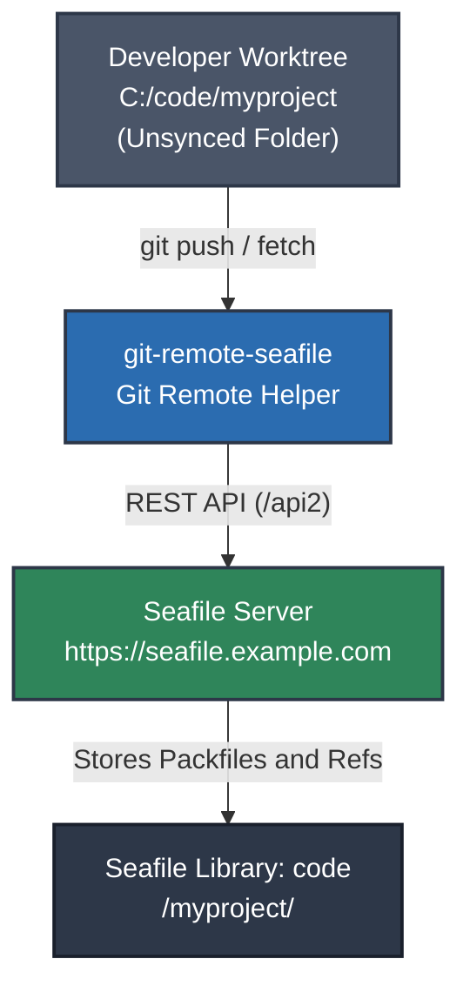

# git-remote-seafile

[](https://github.com/tkittich/git-remote-seafile/actions/workflows/ci.yml)
[](https://opensource.org/licenses/Apache-2.0)
[](https://www.python.org/downloads/)

A transparent, zero-thrash **Git remote helper** for Seafile servers.

`git-remote-seafile` allows you to use your private Seafile server (Community or Professional Edition) as an authentic, secure (HTTPS/TLS), access-controlled Git remote backend using native Git commands (`git clone`, `git push`, `git pull`).

---

## Why This Exists

Storing active Git repositories inside Seafile desktop-synced folders (e.g. `Documents/code/`) causes severe thrashing:
- A single `git commit` writes ~15 files into `.git/` in milliseconds, triggering hundreds of continuous library re-index cycles per day.
- Ephemeral `.git/*.lock` files sync across machines, freezing Git commands on secondary machines.
- Diverging edits generate destructive `(SFConflict ...)` copies instead of Git merges.

### The Solution
Instead of syncing the local `.git/` folder, `git-remote-seafile` communicates directly with the **Seafile Web API (`/api2`)**:
- **Zero Daemon Churn**: The desktop sync client never scans or indexes your working repository.
- **Automated Pre-Flight Safety**: Built-in guardrails detect and block path collisions (Trap 1) and download reflection loops (Trap 2) before any data is transferred.
- **Fast & Efficient**: Commits are packed using Git packfiles (`.pack` and `.idx`). Pushing 100 commits uploads only **two files**, with disk-staged streaming avoiding memory spikes.
- **Concurrent Ref Discovery**: Discovers remote branches and tags concurrently using a worker pool while strictly preserving deterministic alphabetical sort order.
- **Smart Pack Filtering**: Bypasses redundant remote pack downloads during fetch when requested commits already exist locally.
- **Fast-forward Protection**: Rejects non-fast-forward pushes unless force-pushed, preventing accidental clobbering.
- **Honest Dry Runs**: `git push --dry-run` answers exactly as a real push would—same namespace and fast-forward decisions—while taking no lock, building no packfile, and writing no ref.
- **SHA-1 and SHA-256 Repositories**: The helper negotiates the remote's object format during ref listing (`option object-format` / `:object-format`), so SHA-256 repositories clone and push natively instead of producing corrupted packs.
- **Ticket-Based Distributed Locking**: Prevents push collisions with server-timestamped lock tickets (`.git-lock.d/<nonce>.json`), dead PID fast-reclaim, in-transfer lease renewal, and ownership fencing that detects a lapsed-and-taken-over lock before any destructive step.
- **Lock Management CLI**: Built-in `lock-status` and `unlock [--force]` subcommands for operator inspection and emergency recovery.

---

## Critical Rule: Working Repository Placement

> [!CAUTION]
> ### DO NOT keep your working repository inside any folder synced by Seafile!
> 
> Your active Git repository (the directory containing your working tree and `.git/`) **MUST be located outside of any folder actively synced by the Seafile desktop client**.
> 
> - **Safe locations**: Any folder that Seafile does not watch or sync, such as `C:\code\myproject`, `C:\Projects\myproject`, or `~/code/myproject`.
> - **Unsafe locations**: Any local directory currently mapped to a Seafile library in your desktop client (such as `C:\Users\<username>\Seafile\...` or a synced folder).
> 
> **Why?**
> If your local repository directory is actively watched by the Seafile desktop client, the sync daemon will continuously monitor, lock, and re-index the internal `.git/` files on every commit or branch switch. `git-remote-seafile` communicates directly with your Seafile server over HTTP/HTTPS Seafile Web API (`/api2`)—just like GitHub or GitLab. Keeping your working folder unsynced allows Git to operate at native filesystem speed with zero desktop client interference.
> 
> **Need to store remotes in a synced library?**
> If you store remotes in a synced library like `Documents`, store them under an ignored subfolder such as **`seafile-git/`** (`seafile://Documents/seafile-git/myproject`) or any folder name of your choice (e.g. `git-vault/`), and add that subfolder name to `<library-root>/seafile-ignore.txt`. The name `seafile-git/` is not mandatory—any folder name works as long as it is ignored!
>
> ⚠️ **`seafile-ignore.txt` Traps**:
> - **Must be at library root**: `seafile-ignore.txt` must sit in the synced library root (subfolder ignore files are ignored by the Seafile desktop client).
> - **Never-synced files only**: It only works on files/folders that have not yet been synced; it cannot retroactively ignore already-synced folders.
>
> *(For a completely trouble-free setup, we recommend using a dedicated unsynced library instead!)*

---

## Architecture Overview



---

## Comparison: `git-remote-seafile` vs. "Move Code Out + Git Remotes"

When moving active code out of synced cloud storage, there are two primary paths:
1. **Move Code Out + Traditional Git Remotes** (GitHub, GitLab, Gitea, Forgejo)
2. **Move Code Out + `git-remote-seafile`** (This Project)

Here is how they compare:

| Dimension | Move Code Out + Git Forge (GitHub / Gitea) | Move Code Out + `git-remote-seafile` |
| :--- | :--- | :--- |
| **New Infrastructure** | Requires third-party SaaS (GitHub) or deploying & maintaining a separate server (Gitea/GitLab, database, SSH daemon, domain, backups). | **Zero new infrastructure.** Reuses your existing Seafile server, user accounts, and storage pool. |
| **Privacy & Data Sovereignty** | SaaS: Code stored on 3rd-party servers; Self-hosted: Requires securing a new server stack. | **100% self-hosted & private.** Retains your existing Seafile permissions, SSL, and data retention policies. |
| **Storage & Quotas** | GitHub: 1–2 GB repo soft limits; paid Git LFS bandwidth/storage tiers. | **Uses existing Seafile quota.** Store multi-GB datasets and models with built-in Git LFS custom transfer agent at no extra cost. |
| **Web Code Review & PRs** | **Full web forge:** Pull requests, inline code comments, issue tracking, CI/CD runners (GitHub Actions / GitLab CI). | **VCS storage backend only.** No web code review UI or built-in CI runner (though CI can clone/push via API tokens). |
| **Client Overhead** | Zero background churn. Normal Git Smart HTTP/SSH transport. | Zero background churn. Client-side packfile generation via REST API (`/api2`); push cost is independent of commit count. |
| **Multi-Machine Sync** | Standard `git push` / `git pull`. | Standard `git push` / `git pull` with cooperative distributed lease locking. |
| **Best For** | Open-source projects, large teams needing code review & CI pipelines. | Personal projects, private research, proprietary code, multi-GB LFS assets, zero-maintenance self-hosted remotes. |

> [!TIP]
> **Complementary, Not Mutually Exclusive**: You can use both simultaneously! Keep your open-source remote on GitHub and push an offsite, self-hosted mirror to Seafile using a dual-remote config (`git remote set-url --add --push origin seafile://...`).

---

## Alternative Solutions & Workarounds: Success vs. Failure Modes

Before building `git-remote-seafile`, numerous alternative workarounds were investigated and tested. Here is an overview of how each approach performs:

| Approach / Workaround | Success Cases | Failure Modes & Gotchas | Overall Verdict |
| :--- | :--- | :--- | :--- |
| **1. Live Working Tree in Synced Seafile Folder** (`Documents/code/`) | Works for single-user offline backups if only one machine touches files. | • 1,500+ library re-commit cycles/day.<br>• `.git/*.lock` files sync, deadlocking secondary machines.<br>• Branch switches trigger massive conflict storms (e.g. 1,749 `(SFConflict ...)` files). | ❌ **Fatal failure.** Do not use. |
| **2. Pause Syncing During Development** (`Disable auto sync` / `seaf-cli stop`) | Temporarily reduces local disk/CPU churn while coding. | • Sync pause is strictly *local*—secondary machines keep syncing.<br>• Unpausing causes massive sync latency and conflict explosions.<br>• Human error: forgetting to pause or resume. | ❌ **High failure rate.** Flawed concurrency model. |
| **3. Seafile Ignore Rules** (`seafile-ignore.txt`) | Effectively excludes non-synced build folders (`node_modules`, `dist`) if configured *before* first sync. | • Cannot ignore retroactively (already-synced files keep syncing).<br>• Must be at library root; subfolder ignore files are ignored.<br>• Client parser bug with dot-prefixed folders (`haiwen/seafile#1137`).<br>• Ignoring `.git/` strips Git tracking from other machines. | ❌ **Unviable for Git.** Breaks VCS across machines. |
| **4. Patched Sync Daemon (`vacaboja/seafile` inotify fork)** | Resolves silent omission of Git objects on Linux when `link(2)` creates objects without `IN_CLOSE_WRITE`. | • Strictly Linux-only (`wt-monitor-linux.c`).<br>• Still syncs `.git/*.lock` files, freezing secondary machines.<br>• Multi-file commit writes sync out-of-order over HTTP, causing peer corruption (`fatal: bad object HEAD`).<br>• On Windows, rapid edits trigger 1-second `mtime` truncation (missed updates) and mandatory sharing locks (`ERROR_SHARING_VIOLATION`).<br>• Maintenance overhead: pins `seafile-daemon` (9.0.18+1) via `apt-mark hold`. | ❌ **Incomplete.** Fixes an inotify drop bug; core concurrency and locking remain broken. |
| **5. Generic Cloud Sync on `.git/`** (Dropbox, OneDrive, Syncthing) | Single-file document sync. | • Cloud sync is not atomic across multi-file transactions.<br>• Conflicts in `.git/` corrupt repo state (`fatal: bad object HEAD`).<br>• Files-on-demand placeholders cause Git IO crashes. | ❌ **Fatal failure.** Repositories inevitably corrupt. |
| **6. Git Bundles in Synced Folder** (`git bundle create`) | Creates single, atomic `.bundle` files that Seafile can sync without `.git/` churn. | • Terrible developer ergonomics (manual bundling/unbundling).<br>• No standard `git push`/`git pull`.<br>• No branch tracking or automated conflict detection. | ⚠️ **Clunky.** Safe for cold archives only. |
| **7. Bare Git Repo in Synced Folder** (`git init --bare`) | Working tree is outside Seafile; push to local bare repo via `file://`. | • Bare repos contain hundreds of loose objects that Seafile still syncs asynchronously.<br>• Multi-machine concurrent pushes corrupt `refs/heads/main`. | ❌ **Unreliable.** Suffers from asynchronous sync lag. |
| **8. Move Code Out + Git Forge** (GitHub / Gitea) | Full developer platform, PRs, CI/CD, industry standard. | • Requires separate SaaS account or hosting/maintaining another server stack. | ✅ **Recommended** for teams & code review. |
| **9. Move Code Out + `git-remote-seafile`** | Zero new servers, uses existing Seafile storage & accounts, native Git CLI, Git LFS support, distributed locking. | • Does not provide a web-based pull request / code review UI. | ✅ **Recommended** for private self-hosted Git storage. |

---

## Quick Start

### 1. Installation
```bash
pip install git+https://github.com/tkittich/git-remote-seafile.git
```
*(Or clone and install in editable mode: `pip install -e .`. This repository ships wheels and sdists as [GitHub Release](https://github.com/tkittich/git-remote-seafile/releases) assets; PyPI publication is deferred to the official Seafile repository once this code is merged upstream.)*

### 2. Verify Authentication
`git-remote-seafile` automatically discovers active logins from your local Seafile desktop client:
```bash
git-remote-seafile check-auth
# Output: Authenticated successfully with https://seafile.example.com as user@example.com
```

### 3. Create a Remote Library on Seafile (One-Time Setup)
Before pushing for the first time, create a library on your Seafile server to hold your Git repositories:
1. Open the Seafile Web UI (e.g. `https://seafile.example.com`).
2. Click **New Library** and choose any name you like (e.g. `code`, `git-repos`, or `projects`). We will use `code` in the examples below.
3. **Important**: Do **not** sync this library in your desktop client applet. Leave it in the cloud to prevent local sync interference.
*(Alternatively, to store remotes inside an existing synced library like `Documents`, see the ignored subfolder workflow (e.g. `seafile-git/`) in the User Guide).*

### 4. Push Any Repository
```bash
cd C:\code\myproject

# Add Seafile as a remote: seafile://<library-name>/<path>
git remote add origin seafile://code/myproject

# Push your branch
git push -u origin main
```

### 5. Clone on Another Machine
```bash
git clone seafile://seafile.example.com/code/myproject
```

### 6. Built-in CLI Subcommands
`git-remote-seafile` provides CLI subcommands for verification, diagnostics, and lock management:

| Command | Description |
| :--- | :--- |
| `git-remote-seafile check-auth` | Verify authentication credentials against the Seafile server. |
| `git-remote-seafile check-safety <url>` | Test pre-flight safety guardrails (Trap 1 & 2 path collisions). |
| `git-remote-seafile lock-status <url>` | Inspect remote repository lock status and lease holder details. |
| `git-remote-seafile unlock <url> [--force]` | Release a held lock or forcibly break an abandoned lock. |
| `git-remote-seafile gc <url> [--min-packs N]` | Consolidate and delta-compress remote packfiles—also runs automatically after a push. Fail-closed: refuses to compact if any pack fails to download or verify, or if refs sit outside heads/tags. |
| `git-remote-seafile lfs-transfer <url>` | Git LFS Custom Transfer Agent—invoked by Git LFS itself once you point it here (`git config lfs.customtransfer.seafile.*`, see [USER_GUIDE.md](USER_GUIDE.md)). No manual invocation needed. |
| `git-remote-seafile set-head <url> <branch>` | Set default branch (`HEAD`) pointer after verifying branch exists. |
| `git-remote-seafile test <url>` | Discover refs and verify connectivity without cloning. |
| `git-remote-seafile desktop-url <path>` | Convert a local synced directory path to a `seafile://` remote URL. |

---

## Documentation

- [User's Guide (USER_GUIDE.md)](USER_GUIDE.md): Full walkthrough of setup, configuration files, multi-account usage, and dual-remote (GitHub + Seafile) setups.
- [Architecture & Design Spec (DESIGN.md)](DESIGN.md): Technical protocol specifications and upstream RFC for Seafile maintainers.
- [Snapshot Tool Design (SNAPSHOT.md)](SNAPSHOT.md): The design of the whole-tree snapshot tool — the vault, byte-exactness, multi-machine semantics, and the measured cost model.
- [Changelog (CHANGELOG.md)](CHANGELOG.md): What changed in each release.
- [Contributing Guidelines (CONTRIBUTING.md)](CONTRIBUTING.md): How to contribute, run tests, and adhere to development standards.
- [Engineering Roadmap (ROADMAP.md)](ROADMAP.md): Prioritized features, architectural backlog, and version milestones.

### Whole-tree snapshots: `tools/seafile_snapshot.py`

A `.gitignore`d file never enters a commit, so **no remote helper can carry it** — `.env`, a local database, build output. `tools/seafile_snapshot.py` closes that gap: it captures the working tree **as it lies on disk**, ignored files and all, into versioned, byte-exact snapshots in a Seafile library, over the same transport the helper uses.

Every option has a default, so the first run is the only one that needs an argument — and later runs can be a bare command:

```bash
cd C:/code/myproject

# Snapshot into C:/code/myproject-vault and push it to Seafile, inferring the
# destination from the source repo's own seafile:// remote
python tools/seafile_snapshot.py

# Preview it: the vault is initialised if missing and the snapshot staged into
# its index, so the diff you see is real -- nothing is pushed and no setting changes
python tools/seafile_snapshot.py --dry-run

# Restore into a fresh directory, verifying byte-exactness on the way
python tools/seafile_snapshot.py --restore --remote seafile://code/myproject-vault \
    --into C:/restore/myproject
```

The destination, branch and exclusions are **remembered in the vault** after the first run, so a scheduled job can be nothing more than `python tools/seafile_snapshot.py`. It maintains a **separate vault repository** whose `--work-tree` is the source, so the source stays read-only and untouched. Byte-exactness is enforced with `core.autocrlf=false` plus `* -text -filter -ident` in the vault's own `info/attributes` — a plain `git clone` of the vault silently loses that, which is why `--restore` exists. Recommended junk exclusions are **never applied silently**: the tool captures everything and tells you what it noticed, because a backup that quietly omits a file is worse than a large one. See [USER_GUIDE.md §15](USER_GUIDE.md) for the walkthrough and [SNAPSHOT.md](SNAPSHOT.md) for the full design.

### Diagnostics for the Seafile desktop client

`tools/seafile_doctor.py` is a read-only diagnostic for the Seafile **sync
client**. It is for the case the [Critical Rule](#critical-rule-working-repository-placement)
above is about: a repository that has been living inside a synced library, where
you need to see what the client did. It answers questions `git status` cannot,
because the evidence lives in the client's own databases rather than in the
working tree.

```bash
python tools/seafile_doctor.py report    # everything below, in one pass
python tools/seafile_doctor.py libs      # which libraries are synced, and where
python tools/seafile_doctor.py where ~/Documents/code/app   # is this inside a synced library? (exit 1 = no)
python tools/seafile_doctor.py errors    # the client's sync-error table, decoded
python tools/seafile_doctor.py conflicts # the *SFConflict* residue, by month
python tools/seafile_doctor.py churn     # re-commit / upload cycles per day
python tools/seafile_doctor.py identity  # machine-identity history

`report` runs libs, identity, errors, conflicts and churn (not `where`,
which needs a path argument).
```

It copies the client's databases to a temporary directory before opening them,
so a running client is never blocked or torn, and it never writes anything back.

---

## Acknowledgments & Inspirations

`git-remote-seafile` builds upon pioneering work in the Git remote helper and cloud storage ecosystem:
- [git-remote-dropbox](https://github.com/anishathalye/git-remote-dropbox) by Anish Athalye: The landmark implementation that demonstrated transparent Git packfile transport and distributed locking over cloud storage APIs.
- [git-remote-gcrypt](https://spwhitton.name/tech/code/git-remote-gcrypt/) by Joey Hess: Pioneered decentralized, encrypted Git remotes.
- [git-remote-s3](https://github.com/jason-riddle/git-remote-s3): Git remote helper for Amazon S3 object stores.
- [Git Remote Helpers Protocol Specification](https://git-scm.com/docs/git-remote-helpers): Official Git documentation on building custom remote helpers.
- [Git LFS Custom Transfer Agent Protocol](https://github.com/git-lfs/git-lfs/blob/main/docs/custom-transfers.md): Specification for custom large-object transport agents.
- [Seafile Web API v2.1](https://manual.seafile.com/develop/web_api_v2.1/): The underlying REST API provided by Seafile Ltd.

---

## AI Disclosure & Authorship

This project—including its source code, test suites, architecture design, and documentation—was authored primarily with generative AI assistance from multiple AI systems, in collaboration with human architectural design, real-world forensic diagnostics, and verification by [@tkittich](https://github.com/tkittich). All code and protocol implementations are fully open source, tested on Windows (with GitHub Actions CI configured for cross-platform runs), and licensed under the Apache License 2.0.

---

## License

Licensed under the [Apache License, Version 2.0](LICENSE).
